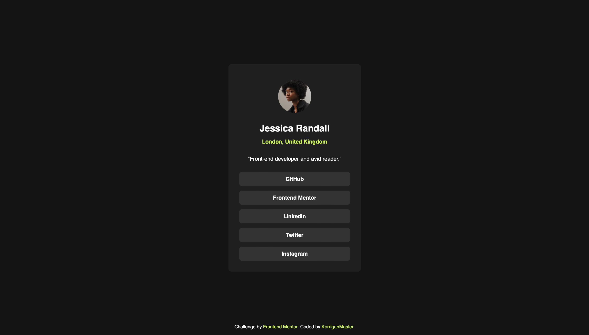
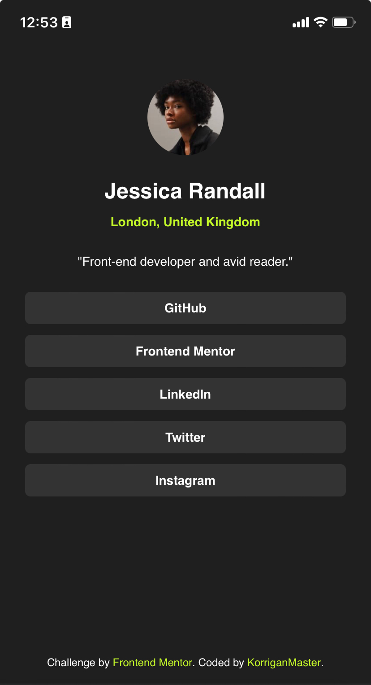

# Frontend Mentor - Social links profile solution

[](https://app.netlify.com/sites/fem-social-links-profile/deploys) [](https://github.com/KorriganMaster/social-links-profile/actions/workflows/node.js.yml)

This is a solution to the [Social links profile challenge on Frontend Mentor](https://www.frontendmentor.io/challenges/social-links-profile-UG32l9m6dQ). Frontend Mentor challenges help you improve your coding skills by building realistic projects. 

## Table of contents

- [Overview](#overview)
  - [The challenge](#the-challenge)
  - [Screenshot](#screenshot)
  - [Links](#links)
- [My process](#my-process)
  - [Built with](#built-with)
  - [What I learned](#what-i-learned)
- [Author](#author)
- [Acknowledgments](#acknowledgments)

**Note: Delete this note and update the table of contents based on what sections you keep.**

## Overview

### The challenge

Users should be able to:

- See hover and focus states for all interactive elements on the page

### Screenshot





### Links

- Solution URL: [GitHub repository](https://github.com/KorriganMaster/social-links-profile)
- Live Site URL: [Netlify](https://links.korrigansoft.com)

## My process

### Built with

- Semantic HTML5 markup
- CSS custom properties
- Flexbox
- Mobile-first workflow
- [Astro](https://astro.build) - JS Web framework
- [Tailwind CSS](https://tailwindcss.com) - For styles

### What I learned

With this project I've been able to explore Tailwind CSS settings and how to extend the default theme with custom values. I especially use it to add colors and font family required for the project using the tailwind.config.mjs file:

```js
export default {
	...
	theme: {
		extend: {
			colors: {
				secondary: {
					100: 'hsl(75, 94%, 57%)',
				},
				grey: {
					700: 'hsl(0, 0%, 20%)',
					800: 'hsl(0, 0%, 12%)',
					900: 'hsl(0, 0%, 8%)',
				},
			},
		},
		fontFamily: {
			'sans': ['Inter', 'sans-serif'],
		},
	},
	...
}
```

## Author

- Frontend Mentor - [@KorriganMaster](https://www.frontendmentor.io/profile/KorriganMaster)

## Acknowledgments

I choose to adapt a little the mobile design and decided to make full page with no margins.
